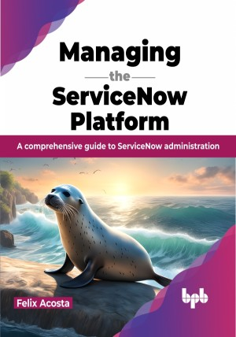

# Managing the ServiceNow Platform

Everything you need to know about managing the ServiceNow platform, in one place

This is the repository for [Managing the ServiceNow Platform
](https://bpbonline.com/products/managing-the-servicenow-platform?variant=43024532472008),published by BPB Publications.

## About the Book
The ServiceNow platform is a powerful tool for managing IT services, but it can be complex to manage. This book provides a comprehensive guide to managing the ServiceNow platform effectively, from the core architecture concepts to scripting and integration.

Whether you're a beginner or an experienced administrator, this book will help you get the most out of the ServiceNow platform. You'll learn how to manage users and access, manage licensing, move configuration across environments, manage upgrades, and configure forms, workflows, business rules, and more. You'll also learn about foundational data such as locations and groups, how to configure notifications and the mobile app, and how to import and export data. And, of course, no book on managing the ServiceNow platform would be complete without a discussion of scripting and integration. In addition to the core topics, this book also covers some more advanced topics such as managing technical debt in the ServiceNow platform.

By the end of the book, you will be able to manage the ServiceNow platform effectively and efficiently.

## What You Will Learn
• Learn how to manage users, groups, access, settings, and integrations.

•  Create and configure forms, workflows, business rules, and more.

•  Integrate ServiceNow with other systems to streamline workflows and automate tasks.

•  Learn how to import, export, and protect your ServiceNow data.

•  Keep ServiceNow running smoothly by troubleshooting and resolving problems.
